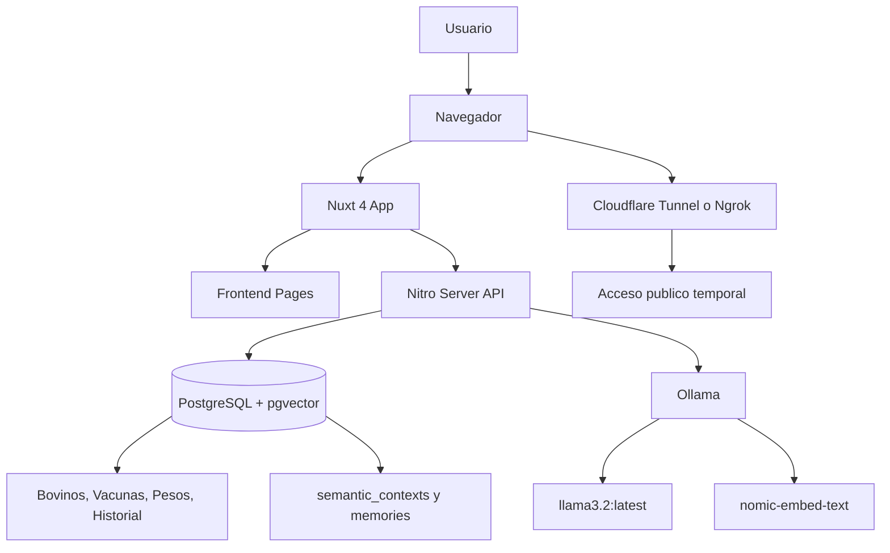

# Entregable Semana 06 - Ganaderia_AI

## Portada

**Proyecto:** Ganaderia_AI  
**Entrega:** Semana 06  
**Tema:** Dockerizacion, persistencia, exposicion publica, pruebas E2E e IA conversacional  
**Alumno:** PENDIENTE  
**Materia:** PENDIENTE  
**Docente:** PENDIENTE  
**Fecha:** PENDIENTE  

## Resumen

Ganaderia_AI es una aplicacion fullstack para gestion de ganado bovino con inteligencia artificial local. El sistema permite registrar y consultar bovinos, duenos, ranchos, vacunas, pesos, enfermedades, ventas e historial de propiedad.

La IA funciona con Ollama, RAG, pgvector, memorias de usuario, function calling y streaming SSE.

## Arquitectura

La aplicacion usa una arquitectura monolitica fullstack con Nuxt 4:

- Frontend: `pages/`, `components/`, `layouts/`, `middleware/`.
- Backend: `server/api/` con Nitro Server Routes.
- Logica reutilizable: `lib/` y `server/lib/`.
- Base de datos: PostgreSQL con pgvector.
- IA local: Ollama.
- Pruebas: Playwright.
- Infraestructura local: Docker Compose.

## Diagrama Mermaid



## Docker Compose explicado

El archivo `docker-compose.yml` levanta dos servicios principales:

### Servicio `postgres`

- Imagen: `pgvector/pgvector:pg16`.
- Contenedor: `ganaderia_db`.
- Puerto local: `5433`.
- Puerto interno: `5432`.
- Volumen persistente: `postgres_data`.
- Inicializacion opcional: `database/seeds.sql` se monta en `/docker-entrypoint-initdb.d/001-seeds.sql`.
- Healthcheck: `pg_isready`.

### Servicio `ollama`

- Imagen: `ollama/ollama:latest`.
- Contenedor: `ollamaganaderia`.
- Puerto local: `11435`.
- Puerto interno: `11434`.
- Volumen persistente: `ollama_data`.
- Healthcheck: `ollama list`.

## Flujo de ejecucion

```bash
npm install
docker compose up -d
npm run db:seed
docker exec -it ollamaganaderia ollama pull llama3.2:latest
docker exec -it ollamaganaderia ollama pull nomic-embed-text
npm run dev
```

Abrir:

```text
http://localhost:3000
```

## Prueba E2E con Playwright

Comando:

```bash
npm run test:e2e:ia
```

La prueba valida:

- Login con usuario demo.
- Navegacion a `/ia`.
- Pregunta conversacional: `¿Qué puedes hacer?`.
- Respuesta relacionada con Ganaderia AI, bovinos, vacunas o pesos.

Reporte:

```bash
npx playwright show-report
```

## Exposicion publica

### Cloudflare Tunnel

```bash
cloudflared tunnel --url http://localhost:3000
```

URL publica:

```text
PENDIENTE
```

### Ngrok

```bash
ngrok http 3000
```

URL publica:

```text
PENDIENTE
```

## Evidencias pendientes

| Evidencia | Estado | Archivo o captura |
| --- | --- | --- |
| Docker Compose levantado | PENDIENTE | PENDIENTE |
| Volumenes persistentes visibles | PENDIENTE | PENDIENTE |
| Modelos Ollama descargados | PENDIENTE | PENDIENTE |
| App local en `localhost:3000` | PENDIENTE | PENDIENTE |
| Login exitoso | PENDIENTE | PENDIENTE |
| Chat IA respondiendo | PENDIENTE | PENDIENTE |
| Playwright ejecutado | PENDIENTE | PENDIENTE |
| Reporte Playwright | PENDIENTE | PENDIENTE |
| Tunel publico activo | PENDIENTE | PENDIENTE |
| App accesible desde URL publica | PENDIENTE | PENDIENTE |

## Bitacora de conectividad externa

| Fecha | Herramienta | URL publica | Hora inicio | Hora fin | Resultado | Observaciones |
| --- | --- | --- | --- | --- | --- | --- |
| PENDIENTE | Cloudflare/Ngrok | PENDIENTE | PENDIENTE | PENDIENTE | PENDIENTE | PENDIENTE |

## Tabla de latencia local vs publico

No inventar datos. Completar durante la prueba real.

| Entorno | Pregunta | TTFT | Latencia total | Resultado | Observaciones |
| --- | --- | --- | --- | --- | --- |
| Local | ¿Qué puedes hacer? | PENDIENTE | PENDIENTE | PENDIENTE | PENDIENTE |
| Publico | ¿Qué puedes hacer? | PENDIENTE | PENDIENTE | PENDIENTE | PENDIENTE |

## Reflexiones individuales

### Reflexion tecnica

```text
PENDIENTE: explicar que se aprendio sobre Docker, persistencia y exposicion publica.
```

### Reflexion sobre IA local

```text
PENDIENTE: explicar ventajas y limites de Ollama local frente a servicios externos.
```

### Reflexion sobre pruebas

```text
PENDIENTE: explicar como Playwright ayuda a validar el flujo conversacional.
```

## Checklist de rubrica

| Criterio | Estado | Evidencia |
| --- | --- | --- |
| Docker Compose funcional | PENDIENTE | PENDIENTE |
| Persistencia de datos | PENDIENTE | PENDIENTE |
| PostgreSQL + pgvector activo | PENDIENTE | PENDIENTE |
| Ollama activo | PENDIENTE | PENDIENTE |
| Modelos descargados | PENDIENTE | PENDIENTE |
| Aplicacion Nuxt ejecutandose | PENDIENTE | PENDIENTE |
| IA conversacional probada | PENDIENTE | PENDIENTE |
| Playwright configurado | PENDIENTE | PENDIENTE |
| Prueba E2E ejecutada | PENDIENTE | PENDIENTE |
| Exposicion publica con tunel | PENDIENTE | PENDIENTE |
| Documentacion tecnica lista | PENDIENTE | PENDIENTE |

## Riesgos y pendientes tecnicos

- La autenticacion actual es client-side con `localStorage`.
- Las credenciales de demo estan en texto plano.
- Hay conexiones locales hardcodeadas a PostgreSQL.
- Algunos endpoints usan SQL directo y otros Drizzle.
- Los schemas SQL y Drizzle no estan completamente sincronizados.
- La exposicion publica debe usarse solo como tunel temporal de demostracion.
