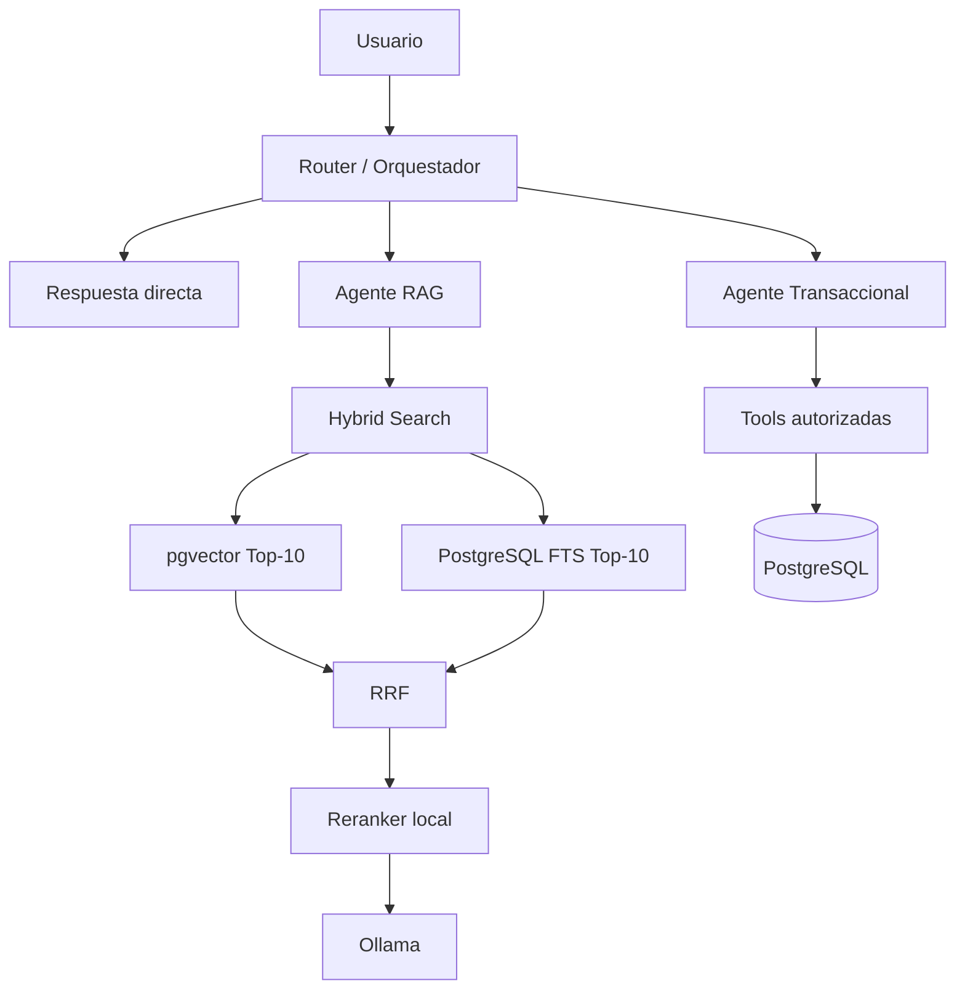

# Ganaderia AI

## Entregable Semana 7

**Asignatura:** ______________________________

**Equipo:** _________________________________

**Integrantes:** ____________________________

**Docente:** ________________________________

**Fecha:** __________________________________

## Arquitectura multiagente

La solucion conserva Nuxt, Nitro, PostgreSQL, pgvector, Ollama y las tools existentes. El router clasifica cada turno por reglas deterministas y delega en un agente transaccional de acceso controlado o en un agente RAG de solo lectura.



## Flujo del router

1. Valida la sesion y propiedad de la conversacion.
2. Lee los mensajes recientes.
3. Aplica guardrails.
4. Clasifica intencion, confianza y motivo.
5. Construye contexto corto y tipado.
6. Ejecuta un solo agente.
7. Registra agente, tools y latencias en `ai_logs`.
8. Mantiene el streaming SSE hacia el chat.

## Agente RAG

El agente RAG responde preguntas explicativas, memorias y conocimiento almacenado. No tiene tools de escritura. Recupera contexto privado del usuario y documentos estaticos locales.

## Agente transaccional

El agente transaccional reutiliza el planner, las confirmaciones y las tools existentes para bovinos, pesos, vacunas, enfermedades y propiedad. No recibe contexto RAG y valida todas las operaciones contra la sesion.

## Transferencia de contexto

Se transfieren hasta ocho mensajes recientes y, cuando existen, el ultimo bovino, vacuna, accion, dueno y rancho. Esto permite referencias como `ponle 350 kg` sin reenviar toda la conversacion.

## Busqueda hibrida y RRF

El pipeline combina similitud coseno con PostgreSQL Full Text Search. RRF usa constante 60 y fusiona ambos rankings sin mezclar escalas de score incompatibles.

## Reranker local

El servicio opcional `reranker` usa `BAAI/bge-reranker-v2-m3`. Si no esta disponible, se usan los Top-3 de RRF y se registra el fallback.

## Seeder de 50,000 registros

El script usa una transaccion y operaciones set-based. Distribuye el total entre bovinos, pesos, enfermedades, vacunas aplicadas, historial y contextos semanticos. `stress_seed_batches` evita repetir un lote completado.

```bash
npm run seed:stress -- --count=50000 --batch=semana07-50k
```

Los embeddings no se generan para todos los contextos por defecto. Debe documentarse el numero real usado con `--real-embeddings=N`.

## LLM-as-a-Judge

El evaluador ejecuta 18 casos contra `/api/ia/evaluate`, usa Ollama como juez local, valida JSON y genera reportes JSON, Markdown y PDF.

```bash
npm run evaluate:agent
```

## Resultados del PDF automatico

**Archivo:** `reports/evaluacion-semana-07.pdf`

**Fecha de ejecucion:** ______________________

**Modelo principal:** ________________________

**Modelo juez:** _____________________________

**Registros en BD:** _________________________

**Precision de ruteo:** ______________________

**Fidelidad:** _______________________________

**Precision de parametros:** _________________

**Seguridad:** _______________________________

**Latencia promedio:** _______________________

No completar esta seccion hasta ejecutar la evaluacion real.

## Evidencias pendientes

- [ ] `docker compose ps` con PostgreSQL y Ollama saludables.
- [ ] Reranker saludable o evidencia del fallback RRF.
- [ ] Consola del seeder con cantidad, tiempo, filas/s y conteos.
- [ ] Consulta SQL con conteos por tabla.
- [ ] Chat mostrando una consulta RAG.
- [ ] Chat mostrando una transaccion con confirmacion y contexto.
- [ ] Intento de prompt injection bloqueado.
- [ ] Pantalla de observabilidad con agente, intencion, tool y latencia.
- [ ] Consola del evaluador completo.
- [ ] Primera pagina y tabla del PDF generado.
- [ ] Reporte Playwright exitoso.

## Bitacora de pruebas

| Fecha | Prueba | Entorno | Resultado | Evidencia |
|---|---|---|---|---|
| __________ | Seeder 10k/50k | Local | __________ | __________ |
| __________ | RAG hibrido | Local | __________ | __________ |
| __________ | Reranker/fallback | Docker | __________ | __________ |
| __________ | Evaluacion 18 casos | Local | __________ | __________ |
| __________ | Playwright | Local | __________ | __________ |

## Reflexiones individuales

### Integrante 1

____________________________________________________________________

### Integrante 2

____________________________________________________________________

### Integrante 3

____________________________________________________________________

## Checklist de rubrica

- [x] Router/orquestador tipado.
- [x] Agente RAG de solo lectura.
- [x] Agente transaccional con tools autorizadas.
- [x] Transferencia de contexto y prevencion de ciclos.
- [x] Busqueda vectorial + FTS + RRF.
- [x] Reranker local con fallback.
- [x] Seeder configurable e idempotente.
- [x] Endpoint no streaming de diagnostico.
- [x] LLM-as-a-Judge local con 18 casos.
- [x] Generacion JSON, Markdown y PDF.
- [x] Observabilidad multiagente.
- [x] Pruebas unitarias y Playwright.
- [ ] Evidencia real de 50,000 registros.
- [ ] PDF completo generado en el equipo de entrega.
- [ ] Capturas y video final.

