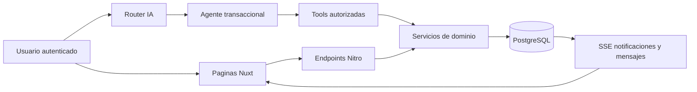

# Plataforma de transferencias, razas y comunidad

## Objetivo

Esta fase amplia Ganaderia AI sin sustituir Nuxt, Nitro, PostgreSQL, pgvector, Drizzle, Ollama ni el router multiagente. Todas las operaciones usan la cookie de sesion firmada y comparten servicios entre la interfaz y Function Calling.

## Arquitectura



## Transferencias

Estados: `PENDING`, `ACCEPTED`, `REJECTED`, `CANCELLED` y `EXPIRED`.

1. El remitente selecciona un bovino propio y un usuario destino.
2. `createBovinoTransfer` valida sesion, propietario, destino y solicitud pendiente.
3. Se crean la solicitud, el evento `REQUESTED`, una notificacion y el registro de auditoria.
4. Mientras esta pendiente, `bovinos.usuario_id` no cambia.
5. El receptor puede aceptar o rechazar. El remitente puede cancelar.
6. Al aceptar se bloquean con `FOR UPDATE` la solicitud y el bovino.
7. Se cambia el propietario, se cierra el historial actual y se abre un nuevo periodo.
8. Se conservan todas las filas relacionadas por `bovino_id`.

Las vacunas aplicadas se remapean a una vacuna equivalente del catalogo receptor. Las memorias con `bovino_id` se asignan al receptor. `semantic_contexts`, pesos, enfermedades y ventas conservan sus IDs.

## Aretes

El arete se conserva si no existe en la cuenta destino. Si hay colision, se reserva el siguiente consecutivo con `bovino_arete_sequences`; `source_arete` y `destination_arete` permanecen en `bovino_transfers`.

## Catalogo de razas

`breeds` incluye 50 razas principales y admite registros personalizados. `bovinos.breed_id` es opcional para datos heredados y obligatorio en nuevas altas desde web. `bovinos.raza` permanece sincronizado para compatibilidad.

La IA muestra como maximo diez resultados y dirige al usuario a `/razas` para consultar el catalogo completo. Una raza inexistente requiere confirmacion antes de crearla.

## Comunidad

- Una solicitud pendiente debe ser aceptada antes de crear conversaciones.
- Las amistades guardan el par ordenado de IDs para evitar duplicados.
- Las conversaciones comunitarias usan tablas separadas de las conversaciones de IA.
- Los mensajes tienen remitente, fecha, contenido y estado leido mediante `last_read_message_id`.
- `/api/community/conversations/:id/stream` entrega mensajes nuevos por SSE.

## Seguridad

- El usuario se obtiene exclusivamente con `requireUserId(event)`.
- Las consultas y mutaciones validan pertenencia o membresia.
- Aceptar como remitente y cancelar como receptor se rechaza.
- Un usuario no puede iniciar chat con alguien que no sea contacto.
- La seleccion ambigua de usuarios nunca elige automaticamente: exige correo exacto.
- La auditoria no almacena contrasenas, cookies ni prompts internos.

## Migracion

```bash
npm run db:migrate:platform
```

La migracion `004_comunidad_transferencias_razas.sql` es aditiva, idempotente y usa `ALTER TABLE ... ADD COLUMN IF NOT EXISTS`. Docker Compose la monta para bases nuevas.

## Endpoints principales

| Dominio | Endpoints |
| --- | --- |
| Usuarios | `GET /api/users/search` |
| Razas | `GET/POST /api/breeds`, `PUT /api/breeds/:id` |
| Transferencias | `GET/POST /api/transfers`, `POST /api/transfers/:id/accept`, `reject`, `cancel` |
| Historial | `GET /api/bovinos/:id/ownership-history` |
| Notificaciones | `GET /api/notifications`, `POST /api/notifications/:id/read`, `GET /api/notifications/stream` |
| Contactos | `GET /api/community/friends`, solicitudes `GET/POST/accept/reject` |
| Chat | conversaciones `GET/POST`, mensajes `GET/POST`, stream `GET` |
| Auditoria | `GET /api/observabilidad/activity` |

## Tools IA

`buscarUsuario`, `crearSolicitudTransferencia`, `aceptarTransferencia`, `rechazarTransferencia`, `cancelarTransferencia`, `listarTransferencias`, `listarBovinosRecibidos`, `listarBovinosEnviados`, `buscarRaza`, `crearRaza`, `listarRazas`, `enviarSolicitudAmistad`, `aceptarSolicitudAmistad`, `rechazarSolicitudAmistad`, `enviarMensaje`, `leerConversacion` y `listarConversaciones`.

## Pruebas

```bash
npm run test
npm run test:e2e:platform -- --project=chromium
npm run build
docker compose config
```

`e2e/platform.spec.ts` usa dos usuarios unicos y comprueba transferencia, persistencia de peso, aislamiento, amistad, chat, notificaciones, IA y carga de las paginas nuevas.

## Riesgos pendientes

- El catalogo inicial no pretende ser una lista mundial exhaustiva.
- SSE hace sondeo cada dos segundos; es adecuado para la escala actual, no para miles de conexiones.
- No existen tablas de fotografias o archivos en el proyecto actual.
- Las confirmaciones IA pendientes no sobreviven reinicios ni multiples instancias.
