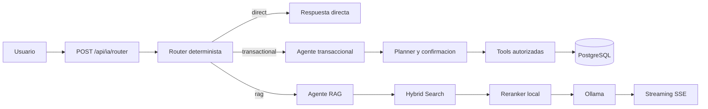

# Semana 7: Arquitectura multiagente

## Objetivo

Separar la decision, las operaciones de base de datos y la recuperacion de conocimiento sin cambiar las rutas publicas ni el streaming SSE del chat.

## Componentes

- `routerAgent.ts`: clasifica por reglas deterministas y devuelve agente, intencion, confianza y motivo.
- `transactionalAgent.ts`: reutiliza `/api/ia/function-calling` y limita la ejecucion a las tools autorizadas.
- `ragAgent.ts`: solo lee contexto recuperado y nunca ejecuta escrituras.
- `agentContext.ts`: conserva hasta ocho mensajes recientes y referencias utiles como bovino, vacuna, accion, dueno y rancho.

## Flujo

## Prevencion de ciclos

El router es el unico componente que selecciona agente. Los agentes no importan ni invocan al router, y el transaccional no puede llamar al RAG. Una solicitud se enruta una sola vez por turno.

## Contexto conversacional

El contexto transferido es estructurado y corto. No se manda la conversacion completa. Las referencias como `ella`, `ponle 350 kg` o `vacunala` se resuelven con el ultimo bovino conocido y el historial reciente.

## Compatibilidad

- La ruta publica `/api/ia/router` no cambia.
- El frontend mantiene el mismo parser SSE.
- Las tools existentes siguen siendo la implementacion de cada operacion.
- Las confirmaciones previas a escrituras se conservan.

