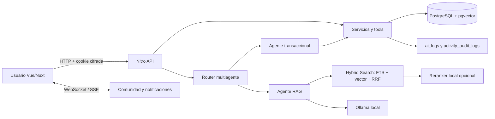

# Auditoría de Seguridad — Ganadería AI

**Fase:** auditoría defensiva y remediación autorizada  
**Fecha y hora:** 2026-07-29 02:39:03 -06:00  
**Validación de túnel:** 2026-07-29 11:18:15 -06:00  
**Remediación local verificada:** 2026-07-29  
**Puntuación de línea base:** **62/100**  
**Puntuación técnica local posterior:** **94/100 (provisional)**  
**Nivel posterior:** **Fuerte, pendiente de validación pública final**  
**Auditoría:** local aislada más validación autorizada y no destructiva de un túnel

## 0. Estado posterior a la remediación

Las secciones 1 a 25 conservan la auditoría original como línea base y explican
cómo se obtuvo el resultado inicial de 62/100. Después de esa auditoría se aplicó
una remediación aditiva sobre el mismo proyecto. La puntuación posterior es
provisional: resume los controles comprobados localmente y no sustituye una nueva
prueba del hostname público ni la ejecución de la imagen opcional del reranker.

### Resultado por hallazgo

| Hallazgo | Estado posterior | Corrección o riesgo residual |
|---|---|---|
| SEC-001 | Corregido | El seed ya no crea administradores conocidos. La migración `009` bloquea las cuentas legacy comprometidas y `npm run admin:bootstrap` crea el administrador con credenciales explícitas y scrypt. |
| SEC-002 | Corregido | La aplicación usa `ganaderia_app`, un rol runtime sin superusuario, `CREATEDB`, `CREATEROLE` ni DDL. `npm run db:runtime:verify` comprobó CRUD permitido y DDL rechazado. |
| SEC-003 | Corregido | Las sesiones v3 son aleatorias, se guardan como hash en `auth_sessions`, expiran, se revocan en logout y aplican una sola sesión activa por cuenta. El replay posterior devuelve `401`. |
| SEC-004 | Corregido | Las escrituras IA públicas por `direct_tool` o `confirmed_action` devuelven `403`; toda escritura natural pasa por propuesta, confirmación y ejecución interna autorizada. |
| SEC-005 | Corregido | Las memorias personales no cambian de usuario durante una transferencia; `memories.transferable` queda en `false` por defecto. |
| SEC-006 | Corregido | El historial se limita a participantes y periodos autorizados; correos e identificadores se enmascaran. |
| SEC-007 | Corregido | `semantic_contexts` declara propietario, alcance, fuente y confianza. Solo se recupera contexto privado del usuario o contexto público marcado explícitamente como confiable. |
| SEC-008 | Corregido | `ai_logs` guarda hashes, longitudes, métricas y tools permitidas; los campos crudos anteriores se redactaron y se fijó retención de 30 días. |
| SEC-009 | Corregido | El directorio exige consulta mínima, limita resultados, enmascara correos y entrega una clave opaca por UUID para seleccionar destinatarios. |
| SEC-010 | Corregido | Se añadieron límites globales de body, texto, memoria, peso y frames, además de restricciones SQL aditivas. |
| SEC-011 | Corregido | El `Host` canónico nunca se toma de `X-Forwarded-Host`; headers reenviados solo se confían cuando el peer inmediato es loopback y `NUXT_TRUST_PROXY=loopback`. |
| SEC-012 | Corregido | Las tools se movieron a `server/ai/tools`; dejaron de formar rutas Nitro y `/api/ia/tools/*` responde `404`. |
| SEC-013 | Corregido | `npm audit` reporta cero vulnerabilidades y `npm ls --all --silent` termina correctamente. |
| SEC-014 | Corregido en código | Vite permite solo loopback. El túnel debe publicar el build Nitro con `npm run tunnel:serve`; falta repetir la prueba sobre un hostname nuevo después de la remediación. |
| SEC-015 | Mitigado | Imágenes principales fijadas por digest; reranker no-root, read-only, sin capabilities y dependencias exactas. No se construyó ni descargó el modelo pesado durante esta fase autorizada. |
| SEC-016 | Corregido | Una base PostgreSQL aislada inició con el orden real de scripts Compose, sin cuentas conocidas y con CRUD runtime funcional. |
| SEC-017 | Corregido | WebSocket y SSE limitan conexiones/eventos, tamaño de frame y revalidan sesión; reindexado tiene cuota y máximo de lote. |
| SEC-018 | Corregido en el alcance local | Contraseñas de 12 a 200 caracteres, lista de valores débiles y rechazo de repeticiones/datos de identidad. La verificación de correo y recuperación segura siguen como mejora de producto. |
| SEC-019 | Corregido | Todas las respuestas API y las páginas de login/registro usan `Cache-Control: private, no-store`. |
| SEC-020 | Corregido | Se retiraron rutas de prueba, se cerró la ruta dinámica no numérica y se eliminaron stacks, paths, tiempos y cabeceras técnicas de las respuestas públicas. |
| SEC-021 | Corregido | Los iconos se empaquetan localmente y Nuxt Icon no usa el fallback remoto de Iconify. |
| SEC-022 | Riesgo aceptado | No se añadió RLS para evitar cambiar la arquitectura y romper consultas actuales. El rol runtime sin privilegios y las comprobaciones de ownership reducen el impacto; RLS queda como defensa adicional futura. |
| SEC-023 | Parcialmente verificado | Pasaron seguridad, IA, multiagente, mejoras y WebSocket en Chromium; la plataforma paso en Chromium, Firefox y WebKit. El reranker y la repeticion HTTPS publica siguen pendientes. |
| SEC-024 | Corregido en aplicación | Con `NUXT_PUBLIC_APP_ORIGIN=https://HOST` el servidor redirige HTTP y emite HSTS en HTTPS confiable. Falta confirmar el comportamiento de edge con un túnel nuevo. |

### Evidencias posteriores

- `npm test`: 64/64 pruebas aprobadas, incluidas redaccion de logs y mensajes 5xx.
- `npm run build`: build Nuxt/Nitro aprobado.
- `npm run typecheck:scripts`: aprobado.
- `npm audit --json`: 0 vulnerabilidades.
- Evidencia directa: `security-audit/test-results/npm-audit-post-remediation.json`.
- `npm ls --all --silent`: árbol consistente.
- `docker compose config --quiet`: aprobado.
- `npm run db:runtime:verify`: CRUD permitido y operaciones privilegiadas rechazadas.
- Bootstrap aislado: 0 cuentas conocidas, 0 administradores de seed, 0 contextos inseguros y rol runtime no privilegiado.
- `npm run test:e2e:security`: 6/6 aprobadas.
- `npm run test:e2e:ia -- --project=chromium`: 1/1 aprobada.
- `npm run test:e2e:multi-agent -- --project=chromium`: 4/4 aprobadas.
- `npm run test:e2e:platform`: 3/3 aprobadas en Chromium, Firefox y WebKit.
- `npm run test:e2e:chat`: 1/1 aprobada.
- `npm run test:e2e:improvements`: 2/2 aprobadas.

### Riesgos residuales que impiden afirmar 100/100

1. Repetir la auditoría no destructiva con un hostname Cloudflare nuevo, sirviendo
   exclusivamente `npm run tunnel:serve`, para validar redirect, HSTS, CSP, Host,
   cookies y ausencia de Vite después de los cambios.
2. Construir y probar el perfil opcional `reranker` cuando se autorice la descarga
   del modelo pesado, y añadir escaneo/SBOM de imágenes en CI.
3. Añadir verificación de correo y recuperación de cuenta para una publicación
   permanente; no se incorporaron servicios externos en esta fase.
4. Evaluar RLS y un bus compartido para despliegues multiinstancia como controles
   de defensa en profundidad, no como sustitutos de los controles actuales.

## 1. Resumen Ejecutivo

Ganadería AI cuenta con una base de seguridad apreciable: passwords nuevas con
scrypt, cookie de sesión cifrada, errores HTTP normalizados, rate limiting
persistente, consultas parametrizadas, filtros de pertenencia y cabeceras web
fuertes. Las 22 pruebas representativas de autorización horizontal pasaron y el
chat WebSocket obtuvo 7/7 en entrega, deduplicación, lectura, reconexión y rechazo
de un tercero.

El riesgo principal está en el arranque y en los límites de confianza. Un volumen
nuevo carga automáticamente dos cuentas administrativas con credenciales conocidas;
además, la aplicación usa el rol superusuario creado por la imagen PostgreSQL.
También se confirmaron sesiones reutilizables tras logout, transferencia implícita
de memorias entre cuentas, historial de propietarios demasiado amplio, escritura IA
directa sin confirmación y contextos RAG sin propietario tratados como globales.
La validación posterior del túnel confirmó TLS/cookie/WebSocket correctos, pero también
que se publicó Vite en modo desarrollo, que HTTP no redirige a HTTPS y que Cloudflare
acepta un `X-Forwarded-Host` suministrado por el cliente.

No se confirmó ejecución remota, SQL injection, acceso horizontal a CRUD, robo de
cookies, XSS almacenado ni exposición de source maps. La severidad crítica que
reporta `npm audit` para `tar` no se trasladó automáticamente a severidad crítica
de la aplicación: es transitiva y no se encontró un endpoint que procese archivos
tar controlados por un usuario.

## 2. Alcance Autorizado

| Elemento | Alcance |
|---|---|
| Código | Workspace local completo de `app/` |
| Aplicación dinámica | `127.0.0.1:3201` |
| Build de producción | `127.0.0.1:3202`, temporal |
| PostgreSQL | Base aislada `ganaderia_ai_security_test`, puerto loopback 55433 |
| Docker | Contenedor aislado `ganaderia_security_db` |
| Ollama | Instancia local en loopback |
| Red externa inicial | Solo `registry.npmjs.org` mediante `npm audit` |
| Túnel autorizado después | `reviewing-outcome-barn-andrews.trycloudflare.com` |
| Datos | Identidades sintéticas y una cuenta de prueba existente para autenticación |
| Producción/otros dominios | Excluidos |

La fase local no consultó ni modificó la base de desarrollo existente. La validación
posterior usó el flujo normal de login y abrió WebSocket sobre la instancia del túnel;
no creó ni eliminó registros de negocio, aunque esos flujos pueden actualizar contadores
de autenticación y `delivered_at`. No se hicieron pruebas de fuerza bruta, flooding,
carga extrema, explotación destructiva ni borrado de datos fuera de la base aislada.

## 3. Metodología

1. Lectura de `AI_CONTEXT.md`, configuración, rutas, servicios, schemas, migraciones,
   agentes, RAG, WebSocket, frontend, Docker y scripts.
2. Inventario estático de rutas y contraste con el manifiesto Nitro de producción.
3. Búsqueda de secretos actuales y revisión específica del historial de `.env`.
4. Inicialización de PostgreSQL aislado y reproducción del seed desde cero.
5. Pruebas API con tres cuentas sintéticas y verificación directa en la base aislada.
6. Pruebas RAG con marcadores sintéticos y Ollama local.
7. Pruebas WebSocket sin renderizar UI ni usar servicios externos.
8. Build, TypeScript, Docker Compose, cabeceras, sourcemaps y rutas del artefacto.
9. `npm audit` completo y de producción, separando severidad del advisory de
   explotabilidad observada.
10. Clasificación por severidad, estado y confianza; cálculo ponderado sin duplicar
    deducciones.
11. Validación autorizada del túnel: TLS, HTTP/HTTPS, cabeceras, archivos sensibles,
    autenticación, cookie, CSRF/origen, CORS, TRACE y WebSocket.

## 4. Limitaciones

- Se probó un único hostname temporal de Cloudflare; no se evaluaron Cloudflare Access,
  WAF, DNS propio, firewall de origen ni una configuración de despliegue permanente.
- No se contactó Ngrok, producción ni ningún otro dominio público.
- No se inició el perfil del reranker porque puede descargar un modelo pesado.
- No se ejecutó un E2E visual completo; WebSocket se comprobó por protocolo tanto local
  como a través del túnel.
- No se hicieron pruebas de disponibilidad agresivas; los riesgos de flooding se
  clasifican como probables.
- La auditoría de secretos fue por patrones y revisión Git dirigida; no reemplaza
  un escáner de entropía histórico dedicado.
- Las pruebas demuestran el estado del commit/worktree local evaluado, que ya
  contenía cambios no confirmados previos a la auditoría.

## 5. Arquitectura Descubierta

Frontend y backend viven en el mismo repositorio Nuxt. Nitro expone la API; los
servicios combinan Drizzle y SQL directo parametrizado. El router IA privilegia
reglas deterministas, luego tools y RAG. PostgreSQL almacena datos ganaderos,
conversaciones, memoria, embeddings y observabilidad.

## 6. Tecnologías

| Capa | Tecnología observada |
|---|---|
| Frontend | Nuxt 4.4.8, Vue 3.5.38, TailwindCSS, Nuxt Icon |
| Backend | Nitro 2.13.4, H3, Vite 7.3.5 |
| Datos | PostgreSQL 16, pgvector, Drizzle ORM, `postgres` |
| IA | Ollama, llama3.2, nomic-embed-text, multiagente, RAG híbrido |
| Tiempo real | WebSocket Nitro y SSE |
| Pruebas | Node test/tsx, Playwright, runners de auditoría |
| Infraestructura | Docker Compose; reranker Python opcional |

## 7. Inventario de Endpoints

| Tipo | Cantidad | Observación |
|---|---:|---|
| Rutas HTTP con sufijo de método | 93 | 89 declaran sesión en la ruta |
| Módulos IA registrados como rutas `ANY` | 28 | No tienen handler HTTP por defecto |
| WebSocket | 1 | `/_ws/community` |
| **Total** | **122** | Inventario completo en evidencia |

Los endpoints públicos intencionales son login y registro. Logout elimina una
cookie aunque no exista sesión. También quedó público un endpoint diagnóstico.
El inventario detallado con archivo, entrada y controles está en
`test-results/endpoint-inventory.md`.

## 8. Datos Ficticios Utilizados

- Tres cuentas base: Auditor Usuario A, Auditor Usuario B y Auditor Admin.
- Tres cuentas adicionales para WebSocket.
- Correos generados exclusivamente bajo `.example.test`.
- Bovinos Auditada Alfa y Auditada Beta.
- Rancho, dueño, vacuna, peso, enfermedad y venta sintéticos.
- Marcadores RAG únicos sin información real.
- Passwords y secretos aleatorios conservados únicamente en memoria.

No se incluyen cookies, hashes, passwords, cadenas de conexión ni datos personales
reales en este reporte.

## 9. Pruebas Ejecutadas

| Grupo | Ejecutadas | PASS | FAIL de control | Error del runner |
|---|---:|---:|---:|---:|
| Unitarias del repositorio | 59 | 59 | 0 | 0 |
| Dinámicas HTTP/API/DB | 60 | 43 | 17 | 0 |
| WebSocket local | 7 | 7 | 0 | 0 |
| Estáticas/instrumentales | 17 | Ver detalle | Ver detalle | 0 |
| Cloudflare Tunnel | 18 | 13 | 5 | 0 |
| **Total contabilizado** | **161** | | | |

Las comprobaciones instrumentales incluyeron inventario, secretos, Git, seed limpio,
rol/RLS, dos auditorías npm, árbol npm, TypeScript, build, dos Compose, cabeceras,
ruta tool de producción, sourcemaps e imágenes Docker.
Las 18 comprobaciones de túnel cubrieron TLS, cabeceras, HTTP, archivos sensibles,
rutas anónimas, login, cookie cifrada, manipulación de cookie, origen, CORS y WebSocket.

## 10. Resumen de Hallazgos

| Severidad | Cantidad |
|---|---:|
| Crítico | 0 |
| Alto | 2 |
| Medio | 14 |
| Bajo | 6 |
| Informativo | 2 |
| **Total** | **24** |

Estados: 21 confirmados, 1 probable y 2 informativos.

### Hallazgos Críticos

No se confirmó ningún hallazgo crítico de aplicación. El advisory crítico de npm
para `tar` se documenta en SEC-013 con severidad media por ser transitivo y no tener
una ruta de entrada productiva demostrada.

## 11. Hallazgos Altos

### SEC-001 — Cuentas administrativas conocidas en el seed automático

- **Categoría:** autenticación.
- **Severidad:** Alto.
- **Estado:** Confirmado.
- **Confianza:** Alta.
- **Archivo/líneas:** `docker-compose.yml:14`; `database/seeds.sql:293-296`;
  `.env.example:18`.
- **Endpoint:** `POST /api/auth/login`.
- **Descripción:** un volumen nuevo ejecuta `seeds.sql`, que crea dos cuentas
  administrativas con passwords triviales conocidas y almacenadas en texto plano.
- **Evidencia:** inspección del seed y montaje automático. Los valores exactos están
  redactados.
- **Impacto real:** una instancia recién publicada puede entregar acceso admin a
  quien conozca el repositorio antes de que las credenciales se roten.
- **Escenario de abuso:** inicio de sesión en una instalación fresca expuesta por túnel.
- **Recomendación:** separar schema de demo data; no crear usuarios por defecto;
  exigir bootstrap admin interactivo con hash fuerte y rotación inicial.
- **Regresión:** iniciar una base vacía y afirmar que no existe ningún usuario admin
  predecible ni password no-scrypt.
- **Esfuerzo:** bajo-medio.
- **Prioridad:** P0, antes de cualquier publicación.

### SEC-002 — La aplicación se conecta como superusuario PostgreSQL

- **Categoría:** seguridad de base de datos.
- **Severidad:** Alto.
- **Estado:** Confirmado.
- **Confianza:** Alta.
- **Archivo/líneas:** `docker-compose.yml:7-8`; `lib/db.ts:4`.
- **Endpoint:** todos los endpoints con acceso a datos.
- **Descripción:** `POSTGRES_USER` crea el superusuario inicial y la misma identidad
  se reutiliza en `DATABASE_URL`.
- **Evidencia:** el rol aislado devolvió `rolsuper=true`, `rolcreatedb=true` y
  `rolcreaterole=true`.
- **Impacto real:** una futura inyección SQL o ejecución en el proceso tendría un
  alcance muy superior al necesario. No se confirmó una inyección actual.
- **Escenario de abuso:** una falla futura permite DDL, lectura global o creación de roles.
- **Recomendación:** crear un owner de migraciones y un rol de runtime no-superusuario
  con privilegios mínimos; eliminar DDL en solicitudes normales.
- **Regresión:** conectar con el rol runtime y verificar que CRUD funciona, mientras
  `CREATE ROLE`, `CREATE DATABASE` y DDL no autorizado fallan.
- **Esfuerzo:** medio.
- **Prioridad:** P0.

## 12. Hallazgos Medios

### SEC-003 — Logout no revoca una sesión capturada

- **Categoría:** autenticación.
- **Severidad/estado/confianza:** Medio / Confirmado / Alta.
- **Archivo/líneas:** `server/utils/session.ts:20,79-120`; `server/api/auth/logout.post.ts:1-5`.
- **Endpoint:** `/api/auth/login`, `/api/auth/logout`, `/api/auth/me`.
- **Descripción:** la sesión es autocontenida por 12 horas; logout solo borra la cookie.
- **Evidencia:** la cookie previa al logout siguió obteniendo 200; dos logins simultáneos
  permanecieron válidos.
- **Impacto:** un token ya copiado conserva acceso hasta expirar.
- **Abuso:** replay desde otro cliente después de que la víctima cierre sesión.
- **Recomendación:** tabla de sesiones con ID, expiración, revocación y rotación.
- **Regresión:** replay posterior a logout debe devolver 401.
- **Esfuerzo/prioridad:** medio / P1.

### SEC-004 — Escrituras IA directas omiten el flujo de confirmación

- **Categoría:** seguridad de IA y autorización de tools.
- **Severidad/estado/confianza:** Medio / Confirmado / Alta.
- **Archivo/líneas:** `server/api/ia/function-calling.post.ts:1221-1276`.
- **Endpoint:** `POST /api/ia/function-calling`.
- **Descripción:** el body acepta `direct_tool` y `direct_args`; cualquier tool no
  incluida en una pequeña denylist se ejecuta inmediatamente.
- **Evidencia:** `crearVacuna` insertó una fila sintética sin confirmación; `crearDueno`
  sí fue rechazada por la denylist.
- **Impacto:** se eluden garantías del planner para cambios en la cuenta autenticada.
- **Abuso:** cliente modificado invoca directamente una tool destructiva/autorizada.
- **Recomendación:** eliminar el modo directo de la ruta pública o exigir un token de
  confirmación server-side ligado a usuario, tool, argumentos y expiración.
- **Regresión:** enviar `direct_tool` sin confirmación no debe cambiar ninguna tabla.
- **Esfuerzo/prioridad:** medio / P0-P1.

### SEC-005 — Las memorias personales se transfieren con el bovino

- **Categoría:** autorización y privacidad.
- **Severidad/estado/confianza:** Medio / Confirmado / Alta.
- **Archivo/líneas:** `server/services/accountTransfer.ts:366-368`.
- **Endpoint:** `POST /api/transfers/:id/accept`.
- **Descripción:** todas las memorias con `bovino_id` cambian del emisor al receptor.
- **Evidencia:** una nota personal sintética quedó bajo el usuario receptor al aceptar.
- **Impacto:** contenido personal o instrucciones IA pueden cruzar cuentas sin consentimiento.
- **Abuso:** el receptor obtiene notas que el remitente consideraba privadas.
- **Recomendación:** clasificar memoria ganadera transferible frente a memoria personal;
  mostrar y confirmar qué contenido viajará o redactarlo.
- **Regresión:** una memoria personal ligada no cambia de usuario; solo artefactos
  explícitamente transferibles lo hacen.
- **Esfuerzo/prioridad:** medio / P1.

### SEC-006 — Un propietario anterior ve transferencias futuras y PII

- **Categoría:** autorización y privacidad.
- **Severidad/estado/confianza:** Medio / Confirmado / Alta.
- **Archivo/líneas:** `server/services/accountTransfer.ts:523-550`.
- **Endpoint:** `GET /api/bovinos/:id/ownership-history`.
- **Descripción:** haber participado una vez concede acceso a todos los eventos futuros
  del bovino, incluidos nombres y correos de terceros.
- **Evidencia:** tras A→B→Admin, A recibió cuatro eventos y el correo del tercero.
- **Impacto:** exposición de relaciones posteriores ajenas al antiguo propietario.
- **Abuso:** un antiguo dueño consulta indefinidamente cambios futuros.
- **Recomendación:** limitar la línea temporal al periodo/eventos donde el solicitante
  participó; enmascarar emails no necesarios.
- **Regresión:** A no debe recibir identidad o eventos posteriores al cierre de su periodo.
- **Esfuerzo/prioridad:** medio / P1.

### SEC-007 — Contextos semánticos sin bovino son globales por omisión

- **Categoría:** IA, RAG y aislamiento.
- **Severidad/estado/confianza:** Medio / Confirmado / Alta para el comportamiento;
  media para una vía de creación remota.
- **Archivo/líneas:** `server/ai/rag/hybridSearch.ts:42,84`.
- **Endpoint:** `POST /api/ia/evaluate` y flujo RAG del router.
- **Descripción:** `bovino_id IS NULL` equivale a contenido global sin columna de
  clasificación, origen, aprobación o tenant.
- **Evidencia:** el agente RAG recuperó el marcador global sintético; no recuperó el
  contexto ligado al bovino de otro usuario.
- **Impacto:** si una fila privada queda sin relación, cruza cuentas; también puede
  contaminar respuestas con instrucciones almacenadas.
- **Abuso:** inserción o migración defectuosa crea contexto NULL que llega a todos.
- **Recomendación:** agregar `scope`, `owner_user_id`, `source`, `trusted` y políticas
  explícitas; no inferir publicidad desde NULL.
- **Regresión:** una fila no clasificada nunca aparece; solo `scope='public'` aprobada.
- **Esfuerzo/prioridad:** medio / P1.

### SEC-008 — Prompts, respuestas y tools se guardan completos

- **Categoría:** protección de datos y logs.
- **Severidad/estado/confianza:** Medio / Confirmado / Alta.
- **Archivo/líneas:** `server/api/ia/router.post.ts:570-589`;
  `database/seeds.sql:236-242`.
- **Endpoint:** rutas IA.
- **Descripción:** `ai_logs` persiste prompt, respuesta y ejecución de tools en texto,
  sin retención, cifrado de campo ni redacción al escribir.
- **Evidencia:** un marcador único quedó almacenado literalmente junto con respuesta/tools.
- **Impacto:** aumenta el alcance de una lectura de BD, backup o consola.
- **Abuso:** datos personales incluidos en preguntas permanecen indefinidamente.
- **Recomendación:** minimización, allowlist de metadatos, redacción previa, TTL y proceso
  de borrado; cifrado de campos si se requiere conservar contenido.
- **Regresión:** prompts con email/teléfono/marcador no aparecen en texto plano.
- **Esfuerzo/prioridad:** medio / P1.

### SEC-009 — Directorio autenticado permite enumerar correos completos

- **Categoría:** privacidad.
- **Severidad/estado/confianza:** Medio / Confirmado / Alta.
- **Archivo/líneas:** `server/services/userDirectory.ts:14-55`.
- **Endpoint:** `GET /api/users/search`.
- **Descripción:** búsqueda parcial o difusa devuelve nombre y correo de hasta 20 cuentas.
- **Evidencia:** un término amplio devolvió dos correos completos de otras cuentas.
- **Impacto:** facilita enumeración, phishing y correlación de usuarios.
- **Abuso:** una cuenta válida recorre términos cortos para construir el directorio.
- **Recomendación:** exigir consulta exacta de correo o umbral mínimo, limitar frecuencia,
  devolver identificador/alias y enmascarar correo hasta confirmación.
- **Regresión:** búsqueda amplia no devuelve emails completos ni más datos de los necesarios.
- **Esfuerzo/prioridad:** bajo-medio / P1.

### SEC-010 — Límites de dominio y tamaño inconsistentes

- **Categoría:** validación de entradas.
- **Severidad/estado/confianza:** Medio / Confirmado / Alta.
- **Archivo/líneas:** `server/utils/api.ts:93-103`;
  `server/api/memories/create.post.ts:202-228`; `server/api/pesos/index.post.ts:8-11`.
- **Endpoint:** `POST /api/pesos`, `POST /api/memories/create`.
- **Descripción:** `positiveNumber` no fija máximo y memories/create no aplica el límite
  de 5000 usado en update.
- **Evidencia:** se aceptó un peso de 999999 kg y una memoria de 6000 caracteres.
- **Impacto:** corrupción lógica y trabajo innecesario de embedding/almacenamiento.
- **Abuso:** un usuario autenticado llena datos imposibles o entradas costosas.
- **Recomendación:** schemas por endpoint, máximos de negocio, límite global de body y
  rechazo antes de Ollama/DB.
- **Regresión:** extremos, NaN, body excesivo y 5001 caracteres reciben 400/413.
- **Esfuerzo/prioridad:** bajo / P1.

### SEC-011 — Cabeceras de proxy controlan origen y rate limit

- **Categoría:** configuración web.
- **Severidad/estado/confianza:** Medio / Confirmado / Alta para el control; media
  para el escenario completo de abuso.
- **Archivo/líneas:** `server/utils/rateLimit.ts:168-172`;
  `server/utils/requestSecurity.ts:33-43`.
- **Endpoint:** middleware global y login/registro.
- **Descripción:** se confía directamente en `CF-Connecting-IP`, X-Forwarded-For,
  X-Forwarded-Host y X-Forwarded-Proto sin lista de proxies confiables.
- **Evidencia:** cambiar `CF-Connecting-IP` creó otro bucket. En el túnel real, un Origin
  extranjero acompañado de `X-Forwarded-Host` y `X-Forwarded-Proto` falsificados recibió
  200 cuando no se envió `Sec-Fetch-Site` (`CFT-011`).
- **Impacto real:** Cloudflare aceptó la cabecera en esta configuración. Los navegadores
  modernos no permiten JavaScript establecer `X-Forwarded-Host` y normalmente envían
  `Sec-Fetch-Site`, por lo que SameSite y el bloqueo cross-site reducen el abuso web.
- **Abuso:** cliente directo falsifica identidad de red o coherencia same-origin.
- **Recomendación:** confiar en forwarded headers solo desde proxies/CIDR configurados;
  canonicalizar el origen público con configuración fija.
- **Regresión:** cabeceras reenviadas desde un peer no confiable no cambian IP/origen.
- **Esfuerzo/prioridad:** medio / P1.

### SEC-013 — Dependencias con advisories y árbol inconsistente

- **Categoría:** cadena de suministro.
- **Severidad/estado/confianza:** Medio / Confirmado / Alta.
- **Archivo/líneas:** `package.json`; `package-lock.json`.
- **Endpoint:** build/dev; no se confirmó endpoint productivo directo.
- **Descripción:** npm reportó 9 vulnerabilidades totales y 6 en el árbol de producción.
  `npm ls --all` marcó una resolución esbuild inválida para una dependencia Vite.
- **Evidencia:** JSON íntegro en `test-results/npm-audit-*.json`.
- **Impacto:** riesgos de DoS/path traversal en herramientas de build; esbuild es relevante
  si se expone el servidor dev. `tar` crítico es transitivo y sin input tar remoto hallado.
- **Abuso:** archivo/build malicioso o exposición accidental del servidor de desarrollo.
- **Recomendación:** actualizar Nuxt/Nitro y lockfile en rama, revisar diff de versiones,
  ejecutar build/E2E y volver a auditar; no usar `npm audit fix --force` a ciegas.
- **Regresión:** `npm ci`, `npm ls --all`, build y audit sin inconsistencias críticas/altas.
- **Esfuerzo/prioridad:** medio / P1.

### SEC-014 — Servidor Vite de desarrollo publicado por el túnel

- **Categoría:** servidor de desarrollo.
- **Severidad/estado/confianza:** Medio / Confirmado / Alta.
- **Archivo/líneas:** `nuxt.config.ts:38-43`; `package.json:8-9`; `README.md:193-204`.
- **Endpoint:** Vite dev, si se publica.
- **Descripción:** se permite cualquier subdominio `.trycloudflare.com`; el túnel probado
  publicó Vite dev y el esbuild usado por Vite está dentro de un advisory Windows.
- **Evidencia:** `/_nuxt/@vite/client` respondió 200 con JavaScript de Vite (`CFT-008`)
  y la CSP pública incluyó `unsafe-eval`, `unsafe-inline`, `ws:` y `wss:` (`CFT-004`).
  Ocho rutas sensibles conocidas respondieron 404 y no se demostró lectura arbitraria.
- **Mitigación existente:** el repositorio incluye `tunnel:serve` para servir el build
  Nitro, pero el hostname evaluado estaba apuntando al servidor de desarrollo.
- **Impacto:** expone HMR y una política CSP debilitada a Internet, aumentando el riesgo
  asociado a vulnerabilidades de herramientas de desarrollo.
- **Recomendación:** eliminar wildcard de Vite, usar host exacto temporal o no permitir
  túnel dev; mantener `tunnel:serve` como única ruta pública.
- **Regresión:** Vite rechaza cualquier trycloudflare no configurado y el túnel apunta a Nitro.
- **Esfuerzo/prioridad:** bajo / P1.

### SEC-015 — Imágenes y reranker no son completamente reproducibles/least-privilege

- **Categoría:** Docker y supply chain.
- **Severidad/estado/confianza:** Medio / Confirmado / Alta.
- **Archivo/líneas:** `docker-compose.yml:27,41-53`;
  `services/reranker/Dockerfile:1-14`; `services/reranker/requirements.txt:1-3`.
- **Endpoint:** servicios locales.
- **Descripción:** Ollama usa `latest`; el reranker usa rangos amplios, descarga/cachea
  modelos y no declara usuario no-root, read-only ni cap drop.
- **Evidencia:** inspección Compose/Dockerfile; bindings loopback sí son correctos.
- **Impacto:** builds no reproducibles y mayor impacto de una dependencia comprometida.
- **Abuso:** actualización flotante introduce comportamiento inesperado.
- **Recomendación:** fijar versiones/digests, hashes Python, usuario no-root, filesystem
  read-only donde aplique, `no-new-privileges` y límites de recursos.
- **Regresión:** reconstrucción offline reproducible y validación de usuario/capabilities.
- **Esfuerzo/prioridad:** medio / P2.

### SEC-016 — El seed original falla en una base nueva

- **Categoría:** integridad y disponibilidad de base.
- **Severidad/estado/confianza:** Medio / Confirmado / Alta.
- **Archivo/líneas:** `database/seeds.sql:373-410`.
- **Endpoint:** inicialización Docker.
- **Descripción:** IDs explícitos de `semantic_contexts` no actualizan la secuencia antes
  del siguiente INSERT implícito.
- **Evidencia:** PostgreSQL abortó por PK duplicada; el shim exclusivo de auditoría permitió continuar.
- **Impacto:** despliegue fresco inconsistente o indisponible.
- **Abuso:** no requiere atacante; es un fallo operativo reproducible.
- **Recomendación:** evitar IDs explícitos o ejecutar `setval`; separar schema, migración y demo seed.
- **Regresión:** inicializar dos veces una base limpia y comprobar éxito/idempotencia.
- **Esfuerzo/prioridad:** bajo / P0-P1.

### SEC-018 — Política de password mínima de seis caracteres

- **Categoría:** autenticación.
- **Severidad/estado/confianza:** Medio / Confirmado / Alta.
- **Archivo/líneas:** `server/api/auth/register.post.ts:28-30`.
- **Endpoint:** `POST /api/auth/register`.
- **Descripción:** una credencial de seis caracteres fue aceptada; no hay verificación de
  email, recuperación o chequeo de passwords comprometidas.
- **Evidencia:** prueba dinámica retornó 202 para longitud seis.
- **Impacto:** aumenta éxito de credential stuffing o adivinación offline tras fuga de hashes.
- **Recomendación:** mínimo 12 caracteres o passphrase, blocklist local, rate limits ya
  existentes y flujo seguro de recuperación/verificación.
- **Regresión:** passwords cortas/comunes reciben `WEAK_PASSWORD`; passphrases válidas pasan.
- **Esfuerzo/prioridad:** bajo-medio / P1.

## 13. Hallazgos Bajos

### SEC-012 — Veintiocho tools internas son rutas HTTP que responden 500

- **Categoría:** superficie y errores.
- **Severidad/estado/confianza:** Bajo / Confirmado / Alta.
- **Archivo/líneas:** `server/api/ia/tools/*.ts`; manifiesto `.output` generado.
- **Endpoint:** `/api/ia/tools/*`, método `ANY`.
- **Descripción/evidencia:** Nitro las registra por estar bajo `server/api`; una solicitud
  anónima devolvió 500 genérico. No ejecutó la función exportada.
- **Impacto/abuso:** enumeración y amplificación de errores/logs limitada por rate limit;
  no se confirmó escritura no autenticada.
- **Recomendación:** mover tools a `server/ai/tools` o `server/services`; dejar solo handlers
  HTTP reales bajo `server/api`.
- **Regresión:** esas 28 URLs devuelven 404 y no aparecen en el manifiesto.
- **Esfuerzo/prioridad:** bajo / P1.

### SEC-017 — Límites específicos ausentes en WebSocket, SSE y reindexado

- **Categoría:** disponibilidad.
- **Severidad/estado/confianza:** Bajo / Probable / Media.
- **Archivo/líneas:** `server/routes/_ws/community.ts:105-151`;
  `server/api/reindexar.post.ts:7-8`; endpoints SSE con intervalos 1500/2000 ms.
- **Endpoint:** WebSocket, streams y `POST /api/reindexar`.
- **Descripción:** no se vio límite por evento/tamaño WebSocket, conexiones simultáneas
  SSE o presupuesto específico de reindexación.
- **Evidencia:** revisión estática; no se hizo flooding ni DoS.
- **Impacto:** consumo elevado por usuario autenticado bajo carga coordinada.
- **Recomendación:** cuotas por sesión/usuario, máximo de frame, backpressure, jobs en cola
  y límites de concurrencia.
- **Regresión:** frames excesivos se cierran con 1009; cuotas devuelven error controlado.
- **Esfuerzo/prioridad:** medio / P2.

### SEC-019 — Respuestas autenticadas sin política explícita de caché

- **Categoría:** privacidad web.
- **Severidad/estado/confianza:** Bajo / Confirmado / Alta.
- **Archivo/líneas:** middleware solo añade no-store a rutas sensibles seleccionadas en
  `server/middleware/security.ts:61-69`.
- **Endpoint:** ejemplo `GET /api/bovinos`.
- **Descripción/evidencia:** la respuesta autenticada no incluyó `Cache-Control`.
- **Impacto:** proxies mal configurados o navegadores compartidos podrían conservar datos;
  no se demostró caché pública de Cloudflare.
- **Recomendación:** `private, no-store` para toda API autenticada y `no-store` en IA.
- **Regresión:** todos los GET autenticados contienen política adecuada.
- **Esfuerzo/prioridad:** bajo / P2.

### SEC-020 — Rutas diagnósticas y metadatos técnicos expuestos

- **Categoría:** manejo de errores y exposición informativa.
- **Severidad/estado/confianza:** Bajo / Confirmado / Alta para rutas; media para mensajes
  de error no ejercitados.
- **Archivo/líneas:** `server/api/conversations/by-user/test.get.ts`;
  `server/api/test.get.ts`; `server/routes/_ws/community.ts:38-47`;
  `server/api/ia/function-calling.post.ts:208-219`.
- **Endpoint:** debug, WebSocket y function-calling.
- **Descripción/evidencia:** el debug público responde 200; producción emite `Server-Timing`
  con chunks/rutas. Ramas WS/tools pueden propagar `error.message` y argumentos a logs.
- **Impacto:** fingerprinting y posible detalle técnico; errores HTTP comunes sí fueron genéricos.
- **Recomendación:** eliminar rutas de prueba, desactivar timings detallados y separar error
  público de metadata interna redactada.
- **Regresión:** debug 404, sin nombres internos en headers, mensajes WS allowlisted.
- **Esfuerzo/prioridad:** bajo / P2.

### SEC-021 — Intento de egress de Iconify durante SSR

- **Categoría:** privacidad/supply chain.
- **Severidad/estado/confianza:** Bajo / Confirmado para el intento / Media para finalización.
- **Archivo/líneas:** módulo `@nuxt/icon` en `nuxt.config.ts`; log de producción.
- **Endpoint:** render SSR `/`.
- **Descripción/evidencia:** el servidor registró que intentaba obtener iconos desde la API
  de Iconify; fue detenido de inmediato. No se confirmó respuesta remota.
- **Impacto:** dependencia de disponibilidad externa y divulgación de nombres de iconos/metadata.
- **Recomendación:** empaquetar todos los iconos localmente y denegar egress en runtime.
- **Regresión:** render del build con red bloqueada sin intentos DNS/HTTP y sin iconos faltantes.
- **Esfuerzo/prioridad:** bajo / P2.

### SEC-024 — HTTP público no redirige a HTTPS

- **Categoría:** transporte web.
- **Severidad/estado/confianza:** Bajo / Confirmado / Alta.
- **Endpoint:** `http://reviewing-outcome-barn-andrews.trycloudflare.com/login`.
- **Descripción:** la versión HTTP devolvió 200 y no incluyó `Location` hacia HTTPS.
- **Evidencia:** `CFT-005`; la versión HTTPS sí presenta TLS 1.3 y HSTS de un año.
- **Impacto:** HSTS protege después de una primera visita HTTPS, pero no corrige un primer
  acceso explícito por HTTP ni una URL compartida con el esquema equivocado.
- **Recomendación:** forzar redirección 301/308 en el edge o proxy y compartir solo HTTPS.
- **Regresión:** toda ruta HTTP redirige al mismo host y ruta bajo HTTPS.
- **Esfuerzo/prioridad:** bajo / P1.

## 14. Hallazgos Informativos

### SEC-022 — No hay RLS; el aislamiento es de aplicación

- **Categoría:** defensa en profundidad.
- **Severidad/estado/confianza:** Informativo / Informativo / Alta.
- **Archivo:** schema PostgreSQL.
- **Descripción:** se observaron cero políticas RLS. Esto no es por sí solo una
  vulnerabilidad y 22/22 pruebas de aislamiento pasaron; el superusuario de SEC-002
  impediría obtener valor real de RLS.
- **Recomendación:** primero crear rol runtime mínimo; luego valorar RLS para tablas
  multitenant críticas.
- **Regresión:** tests de aislamiento a nivel servicio y, si se adopta, de políticas RLS.
- **Esfuerzo/prioridad:** alto / P3.

### SEC-023 — Componentes no evaluados de extremo a extremo

- **Categoría:** cobertura.
- **Severidad/estado/confianza:** Informativo / Informativo / Alta.
- **Archivo:** `services/reranker/` y E2E visual.
- **Descripción:** el reranker y la UI visual completa siguen fuera. TLS, HSTS, cookie,
  origen y WebSocket sí se validaron posteriormente sobre el túnel autorizado.
- **Recomendación:** ejecutar en CI aislado con egress allowlist, certificados locales y
  modelo preempaquetado.
- **Regresión:** suite reproducible sin descargas en runtime.
- **Esfuerzo/prioridad:** medio / P3.

## 15. Falsos Positivos Descartados

| Hipótesis | Resultado |
|---|---|
| CRUD horizontal por cambiar IDs | Descartado en 22/22 casos representativos |
| Tool de lectura accede a bovino de otra cuenta | Descartado |
| WebSocket permite escribir a un tercero | Descartado; error y cero filas |
| SQL injection básica en búsqueda | Descartado; metacaracteres tratados como datos |
| Registro permite asignar rol admin | Descartado; rol persistido como usuario |
| Registro duplicado enumera cuentas | Descartado; respuesta 202 idéntica |
| Cookie manipulada es aceptada | Descartado; 401 |
| Prompt injection directa ejecuta tools | Descartado para variantes probadas |
| Contexto ligado a bovino cruza usuarios | Descartado; solo el caso NULL fue global |
| Tools `server/api/ia/tools` ejecutan sin auth por URL | Descartado; devuelven 500, no función |
| Source maps públicos | Descartado |
| `.env` versionado o en su historial específico | Descartado |
| Advisory `tar` implica RCE pública | No demostrado; se evita esa afirmación |
| Falta de HSTS en HTTP local | No se clasifica; HTTPS no fue probado |

## 16. Aspectos Correctamente Protegidos

- Cifrado autenticado AES-256-GCM para sesión y rechazo de manipulación.
- `HttpOnly`, `SameSite=Strict`, 12 horas y `Secure` condicionado a HTTPS.
- scrypt para registros nuevos y comparación dummy contra usuarios inexistentes.
- Mensajes genéricos de credenciales y registro duplicado.
- Rate limiting persistente con headers estándar.
- SQL parametrizado; no se encontró concatenación de input en consultas críticas.
- Aislamiento CRUD y tool read por usuario.
- Transferencia pendiente no cambia propiedad; solo receptor acepta.
- WebSocket persiste antes de publicar, deduplica y valida participantes.
- Guardrails bloquean instrucciones directas y SQL arbitrario solicitado al agente.
- RAG ligado a bovino y memories filtra por usuario.
- Contexto RAG se etiqueta como no confiable en el prompt especialista.
- Errores HTTP comunes no filtran stack, SQL ni ruta local.
- CSP de producción fuerte, source maps desactivados y servicios Docker en loopback.

## 17. Evaluación por Dominio

### Autenticación

Base criptográfica buena y respuestas anti-enumeración correctas. SEC-001, SEC-003
y SEC-018 impiden considerarla lista para publicación.

### Autorización y Aislamiento

Es el área más sólida: 22/22 pruebas pasaron y WebSocket bloqueó al tercero. Las
excepciones son el contenido implícitamente transferido y la línea temporal futura.

### Base de Datos

Hay FKs, índices, transacciones y consultas parametrizadas. El rol superusuario y
el seed roto concentran las deducciones; RLS queda como defensa futura, no como fallo
independiente.

### IA y Function Calling

El router, guardrails y scoping de lecturas funcionaron. El body `direct_tool` rompe
el modelo de confirmación y debe cerrarse antes de exponer la aplicación.

### RAG y pgvector

La recuperación híbrida respetó bovinos y memorias de usuario. Falta una taxonomía
de alcance para contexto NULL y un pipeline de confianza/procedencia verificable.
El reranker no se probó; su fallback RRF sí permitió responder localmente.

### Docker

Los puertos loopback, healthchecks y volúmenes son positivos. Faltan pinning,
least-privilege del reranker y separación del rol PostgreSQL de runtime.

### Dependencias

El build pasa, pero los advisories y el árbol esbuild inválido requieren una
actualización controlada. No se equipara automáticamente severidad npm a impacto web.

### Cabeceras

CSP, frame denial, nosniff, COOP/CORP, referrer y permissions están presentes. Las
deducciones se deben a forwarded headers, caché y exposición posible de Vite dev.

### Logs y Privacidad

La vista de observabilidad redacta detalles para usuarios normales, pero el dato ya
se guardó completo. Debe aplicarse minimización al escribir, no solo al presentar.

## 18. Evidencias Redactadas

| Evidencia | Ruta |
|---|---|
| Alcance | `security-audit/evidence/00-scope-and-safety.md` |
| Análisis estático | `security-audit/evidence/01-static-analysis.md` |
| Base y seed | `security-audit/evidence/02-database-and-seed.md` |
| Build HTTP | `security-audit/evidence/03-production-http.md` |
| Herramientas/pruebas | `security-audit/evidence/04-tooling-and-tests.md` |
| Egress observado | `security-audit/evidence/05-outbound-observation.md` |
| Cloudflare Tunnel | `security-audit/evidence/06-cloudflare-tunnel.md` |
| Dinámicas | `security-audit/test-results/dynamic-security-tests.json` |
| WebSocket | `security-audit/test-results/websocket-security-test.json` |
| Resultado del túnel | `security-audit/test-results/cloudflare-tunnel-security-test.json` |
| Endpoints | `security-audit/test-results/endpoint-inventory.md` |
| npm audit | `security-audit/test-results/npm-audit-all.json` |
| npm producción | `security-audit/test-results/npm-audit-production.json` |
| Resumen | `security-audit/test-results/validation-summary.json` |

Todos los secretos, cookies y credenciales temporales están ausentes o redactados.

## 19. Sistema de Puntuación

| Categoría | Máx. | Obtenido | Deducción y evidencia principal |
|---|---:|---:|---|
| Autenticación | 15 | 8 | -4 seed admin; -2 revocación; -1 política/lifecycle |
| Autorización y aislamiento | 20 | 18 | -2 transferencia de memoria e historial futuro |
| Datos y privacidad | 10 | 5 | -2 logs IA; -1 directorio; -1 retención; -1 egress/caché |
| Validación de entradas | 10 | 7 | -2 límites confirmados; -1 cuotas de canales costosos |
| Base de datos | 10 | 5 | -3 rol superusuario; -2 seed/integridad |
| IA y RAG | 15 | 8 | -3 direct tool; -2 contexto NULL; -1 procedencia; -1 reranker no evaluado |
| Errores y logs | 5 | 3 | -1 rutas 500/timing; -1 errores/logs técnicos probables |
| Web y cabeceras | 5 | 3 | -1 forwarded trust; -0.5 caché/debug; -0.5 Vite dev |
| Dependencias | 5 | 2 | -2 advisories; -1 árbol inválido/reproducibilidad |
| Docker/local | 5 | 3 | -1 pinning; -1 privilegios/dependencias reranker |
| **Total** | **100** | **62** | **Regular** |

Cada problema se penalizó en una categoría principal. Por ejemplo, SEC-005 y
SEC-006 se cargaron a autorización, no de nuevo a privacidad; SEC-007 se cargó a IA,
no nuevamente a privacidad.

## 20. Puntuación de Línea Base

**62/100 — Regular antes de la remediación.**

El sistema tiene controles funcionales suficientes para una base académica/local,
pero no debe publicarse con un volumen nuevo ni con el servidor Vite hasta resolver
los P0/P1. La puntuación no afirma que el sistema esté comprometido; expresa la
madurez y cobertura de controles observada.

## 21. Plan de Acción Inmediato

1. Retirar cuentas privilegiadas del seed automático y rotar cualquier instancia creada con él.
2. Corregir la secuencia del seed y probar bootstrap limpio/idempotente.
3. Crear un rol PostgreSQL de runtime no-superusuario.
4. Bloquear `direct_tool` público o exigir confirmación server-side verificable.
5. Mover `server/api/ia/tools` fuera del árbol de rutas.
6. Evitar transferencia de memorias personales y limitar historial a participantes/periodos.
7. Eliminar wildcard trycloudflare de Vite; publicar solo el build Nitro.
8. Forzar redirección de HTTP a HTTPS en el edge o proxy.

## 22. Plan a Corto Plazo

1. Implementar sesiones persistentes revocables y política de password robusta.
2. Definir alcance/procedencia de `semantic_contexts` y migrar filas NULL.
3. Redactar y expirar logs IA; agregar borrado por usuario.
4. Endurecer canonical origin y trust proxy.
5. Agregar límites de body, dominio, frames, conexiones y reindexado.
6. Actualizar dependencias en una rama con `npm ci`, build y E2E.
7. Aplicar `Cache-Control` a todas las APIs autenticadas.

## 23. Plan a Mediano Plazo

1. Pinning por digest, SBOM, escaneo de imágenes y usuario no-root.
2. Empaquetar iconos/modelos sin egress de runtime.
3. Valorar RLS después de separar el rol runtime.
4. CI de seguridad aislado con HTTPS local, Playwright y reranker preempaquetado.
5. Política de retención, exportación y eliminación de datos personales.
6. Revisión de amenazas formal para transferencias, memoria y comunidad.

## 24. Pruebas de Regresión Recomendadas

- Base limpia sin usuarios por defecto y seed idempotente.
- Rol runtime incapaz de DDL/crear roles.
- Replay de cookie tras logout devuelve 401.
- Direct tools sin confirmación no mutan datos.
- Matriz A/B para cada CRUD y cada tool.
- Transferencia preserva datos ganaderos pero no memorias personales.
- Antiguo dueño no ve eventos futuros.
- Contextos sin alcance explícito no son recuperables.
- Logs IA no contienen emails, teléfonos, prompts ni resultados crudos.
- Búsqueda de usuario no enumera correos.
- Límites de peso, precio, texto, body y frames.
- Host/origin/IP reenviado con proxy confiable y peer no confiable.
- HTTP redirige siempre a HTTPS y la CSP pública no contiene directivas de desarrollo.
- `/_nuxt/@vite/client` no está disponible en el hostname público.
- URLs `/api/ia/tools/*` devuelven 404.
- `npm ci`, `npm ls --all`, audit, build y Playwright.
- Render SSR sin egress externo.
- WebSocket: entrega, lectura, duplicado, outsider y reconexión.

## 25. Conclusión

Ganadería AI no mostró una ruptura general de aislamiento: los CRUD, tools de lectura,
transferencias pendientes y WebSocket aplican controles efectivos. El mayor riesgo no
es una SQL injection hallada, sino una combinación de configuración inicial peligrosa,
privilegios excesivos y límites de confianza incompletos en sesión, IA y transferencia
de datos.
El túnel confirmó que TLS, cookies y WebSocket funcionan, pero también que el servidor
de desarrollo no debe ser el proceso publicado y que el origen canónico no puede
derivarse de cabeceras reenviadas controlables por el cliente.

Este cierre describe la línea base previa a cambios. La remediación autorizada se
aplicó posteriormente y está resumida en la sección 0, junto con sus pruebas y
riesgos residuales. No debe interpretarse la puntuación posterior como 100/100
hasta repetir la validación del túnel y comprobar el perfil opcional del reranker.
